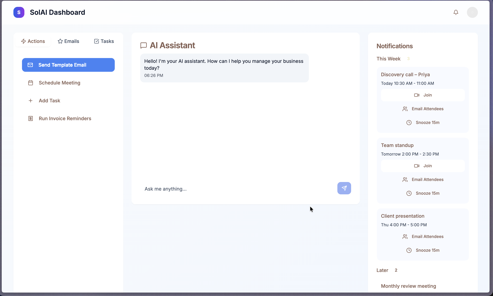
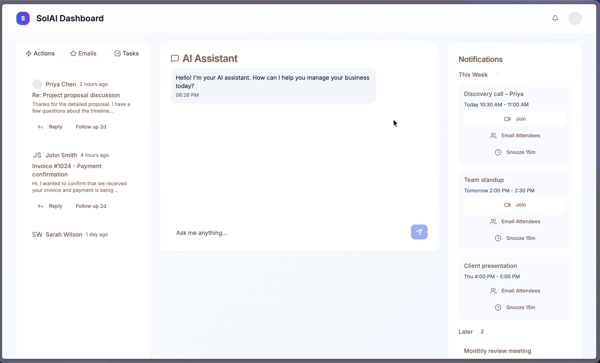
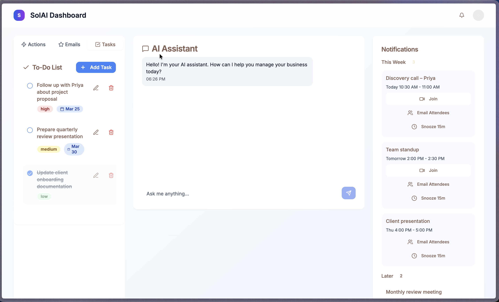
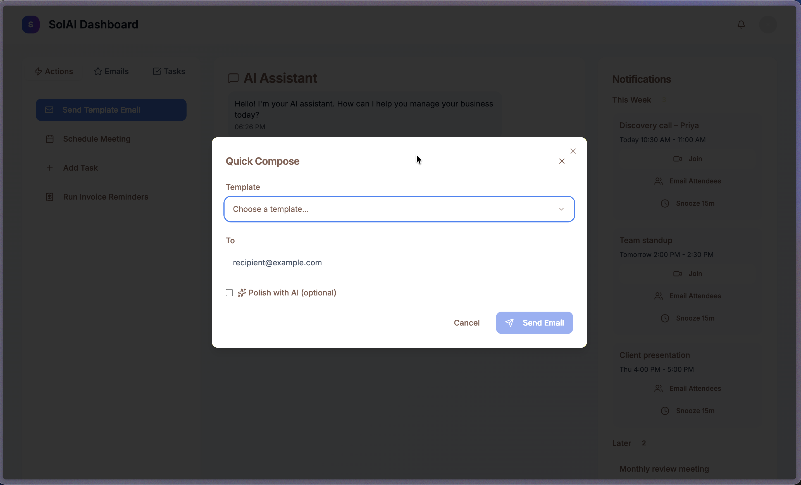
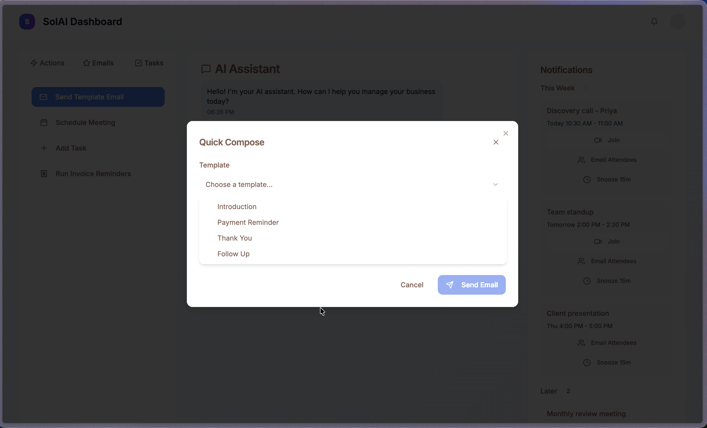
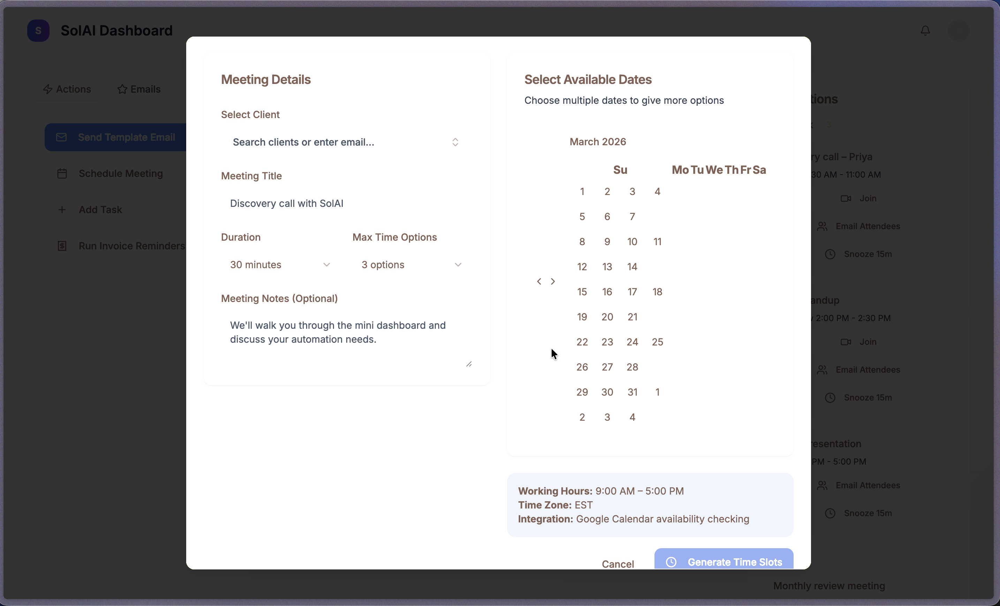

# SolAI Dashboard - Results

This file captures the concrete outcomes of the project, with visual proof points and implementation-level details.

## 1) Project Outcome Summary

SolAI Dashboard successfully demonstrates a production-style, full-stack AI operations interface for business workflow automation.

### Delivered Outcomes

- Built a responsive multi-panel dashboard experience for actions, assistant chat, and notifications.
- Implemented a **templated outbound email workflow** with variable substitution and preview.
- Implemented a **multi-step meeting scheduler** with date selection, slot generation, conflict checks, review, and send flow.
- Integrated **Supabase client profile search** for real lookup + manual email fallback.
- Exposed a backend API layer for workflow actions (email, scheduling, reminders, event sync).
- Set up deployment-ready structure for both Node server and Netlify serverless API routing.

## 2) Results By Feature

### A. Operations Dashboard UX

- 3-column layout with clear information hierarchy:
- Left: action launcher (email templates, scheduling, task/reminder stubs).
- Center: AI assistant interaction panel and recent email context.
- Right: grouped event notifications (`This Week` / `Later`) with actions.

**Result:** Fast “single-screen command center” pattern for daily business operations.

### B. Quick Compose (Template Email)

- Select template, populate variables, review rendered content, optional AI polish flag, and submit.
- Webhook submission payload supports automation handoff (`templateKey`, recipient, vars, AI toggle).

**Result:** Standardized, repeatable outreach flow with lower manual effort and cleaner messaging consistency.

### C. Scheduler Wizard (Meeting Proposals)

- Captures client + meeting details.
- Supports multiple date selection and configurable duration/options.
- Generates candidate slots in working hours and checks availability.
- Allows per-slot editing/removal and final email preview before send.

**Result:** End-to-end meeting proposal workflow that reduces back-and-forth scheduling friction.

### D. Client Lookup (Supabase)

- Pulls and searches client profiles from `client_profiles`.
- Debounced input for better UX/performance.
- Allows immediate custom-email fallback when no client match exists.

**Result:** Practical hybrid of structured CRM-style selection and freeform operation.

### E. Notifications + Follow-up Surface

- Event grouping logic by near-term vs later windows.
- Action affordances for join, email attendees, and snooze.
- Recent starred emails panel with follow-up entry points.

**Result:** Better operator awareness and fewer dropped communication tasks.

### F. API Readiness

Implemented routes:

- `GET /api/ping`
- `GET /api/demo`
- `POST /api/send-template`
- `GET /api/events-today`
- `POST /api/propose-times`
- `POST /api/schedule-followup`
- `POST /api/run-invoice-reminders`
- `POST /api/sync-calendar-events`

**Result:** Clear backend contract for integrating real providers (Gmail, Calendar, Sheets, workflow automation).

## 3) Technical Results

### Architecture

- Full-stack TypeScript split across `client/`, `server/`, and `shared/`.
- Vite + React SPA with integrated Express middleware in dev.
- Separate production outputs for SPA and server runtime.

### UI System

- Tailwind tokenized theme with light/dark-ready variables.
- Radix + shadcn/ui component foundations for scalable UI composition.
- Lucide iconography and reusable interaction primitives.

### Integration Readiness

- Supabase data access in frontend services.
- n8n-style webhook integration pattern modeled in compose/scheduling flows.
- Netlify function wrapper included for serverless API deployment.

## 4) Visual Results Gallery

Place screenshots in `docs/results/` using the filenames below; this section will auto-render as proof of shipped UX.

### Core Dashboard States

1. Default action-focused dashboard

2. Emails tab and starred email context

3. Tasks tab with to-do management

### Modal Workflows

4. Quick Compose modal (closed select)

5. Template selection dropdown

6. Scheduler modal with dual-pane details + calendar

### Expanded Product Direction Screens

7. Integrations board + top navigation

8. Notifications, workflow analytics, market analysis cards

9. AI assistant chat section (light variant)

10. Assistant detail view (text mode)

11. Assistant detail view (voice mode active)

12. Full dashboard dark mode (integrations + cards)

13. Dark mode analytics detail state

14. Dark mode assistant chat section

15. Dark mode assistant detail (text mode)

16. Dark mode assistant detail (voice mode active)

## 5) Recruiter-Facing Impact Statement

This project demonstrates:

- Product-focused frontend engineering (complex workflow UX, modal systems, responsive layouts).
- Full-stack execution ability (UI + API contracts + deployment wiring).
- Integration-minded architecture (Supabase + automation/webhook patterns).
- Strong implementation discipline (componentized structure, reusable primitives, clear growth path).

## 6) Suggested File Mapping (for your screenshot set)

If you want, I can also generate a helper script to validate missing screenshot files against the gallery list above.

